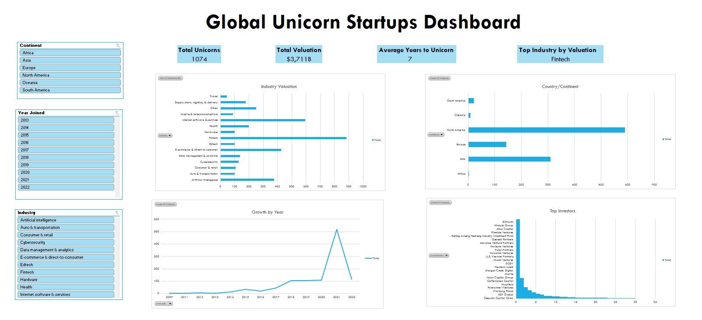

# Global Unicorn Startups Dashboard

An interactive Excel dashboard analyzing 1,000+ global unicorn companies — exploring where startup value is concentrated by industry, region, and time.

**Project Overview**
This project explores valuation and growth trends among the world's unicorn startups (private companies valued at $1B+). The goal was to answer questions a business stakeholder might actually ask:

- Which industries and countries hold the most unicorn value?
- How has the pace of new unicorns changed year over year?
- How long does it typically take a company to reach unicorn status?
- Who are the most active lead investors in this space?

**Tools & Techniques**
- **Excel** — PivotTables, PivotCharts, Slicers, calculated columns, KPI cards
- **Data cleaning** — text-to-number conversion, date parsing, text extraction formulas (`SUBSTITUTE`, `FIND`, `LEFT`, `TRIM`)
- **Dashboard design** — linked slicers for cross-filtering, consistent color system, freeze panes
  

**Key Insights**

- Fintech leads all industries by total valuation at ~$882B, followed by Internet software & services at about $595B
- North America dominates by unicorn count, followed by Asia and Europe
- The number of new unicorns spiked sharply around 2021, reflecting the major expansion in startup funding during that period, before declining substantially in 2022
- The average time from founding to reaching unicorn status is 7 years
- Sequoia Capital China appears as the most frequent lead investor among unicorn companies in this dataset

**Data Source**
Dataset: [Unicorn Companies](https://mavenanalytics.io/data-playground) — Maven Analytics Data Playground (free for practice/portfolio use).

**How to Use**
1. Download `Unicorn_Startups_Dashboard.xlsx`
2. Open in Excel (2016 or later recommended for full Slicer support)
3. Use the Industry / Continent / Year slicers on the Dashboard sheet to filter all charts at once

*Built as a portfolio project for educational purposes.*
